# Android Application Documentation
## Table of Contents
- [Overview](#Overview)
- [User Activities](#user-activities)
- [Admin Activities](#admin-activities)
- [admin-instructions](#instructions-for-admin)

## Overview
This is a **Android** frontend for a **Movie Management System** that integrates with a **Node.js backend**. The system allows users to **browse, search, add, edit, and delete movies and categories** while maintaining user authentication and admin roles.

This android app availble in two languges, English and Spanish, depends on your phone settings.

## User Activities

### 1. Welcome Activity
- The landing page of the application.
- Displays a hero banner or introductory section.

  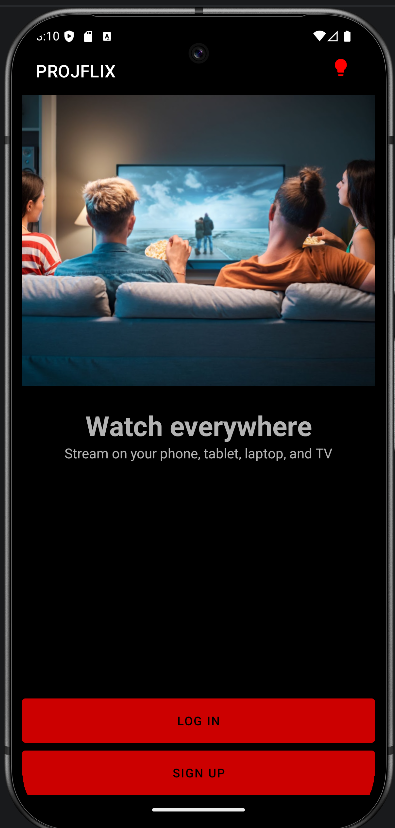

- In light mode:

  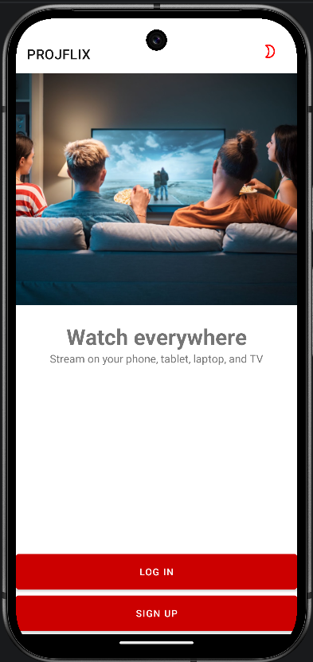

### 2. SignUp Activity
- Allows new users to **create an account**.
- Contains fields for **email, password, confirm password, and profile picture**.

  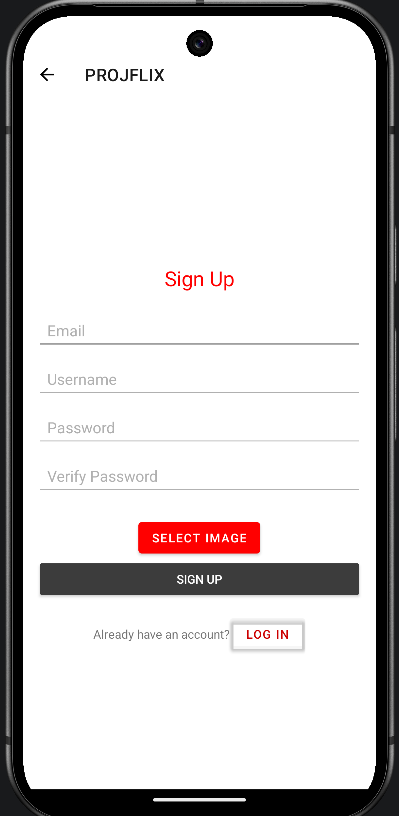

### 3. LogIn Activity
- Enables existing users to **log in**.
- Requires **email and password**.

  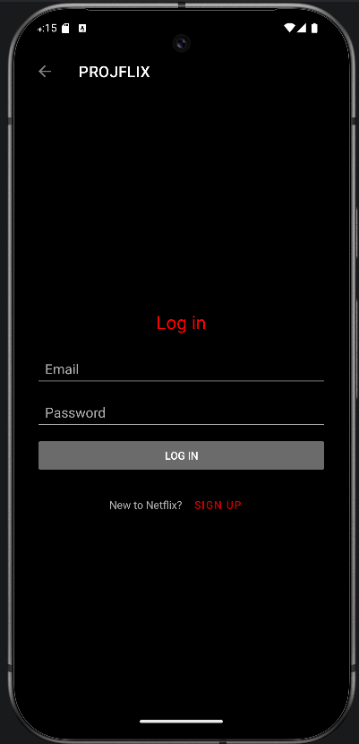

### 4. Home Activity
- Displays **movies categorized by promoted categories**.
- Each category appears as a list of **small-sized movie component** using recaycler view.

  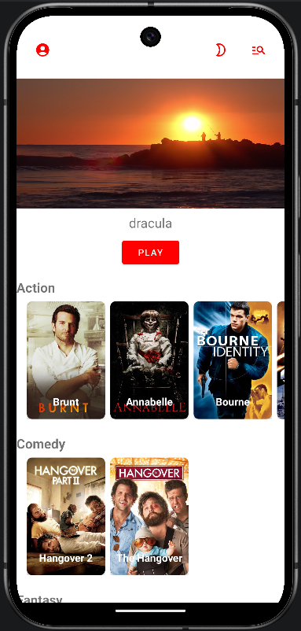

### 5. Search Activity
- Allows users to **search movies dynamically**.

  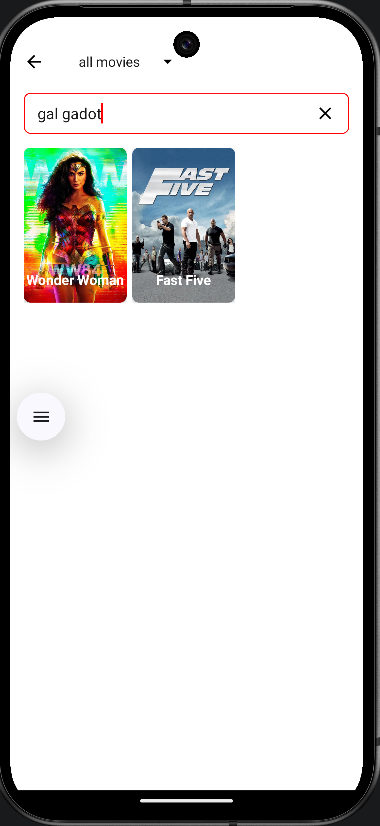

- Allows users to watch movies by category

  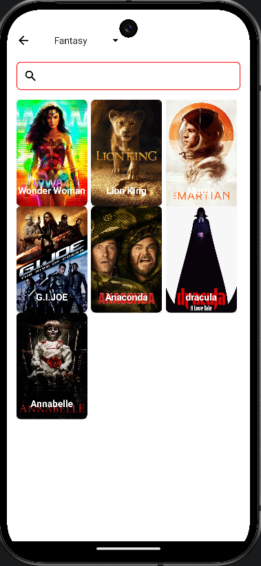

- In light mode:

  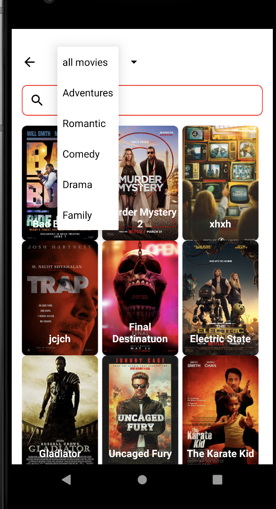

### 6. Profile activity
- Displays user **profile details**.
- Alows the user to sign out 

  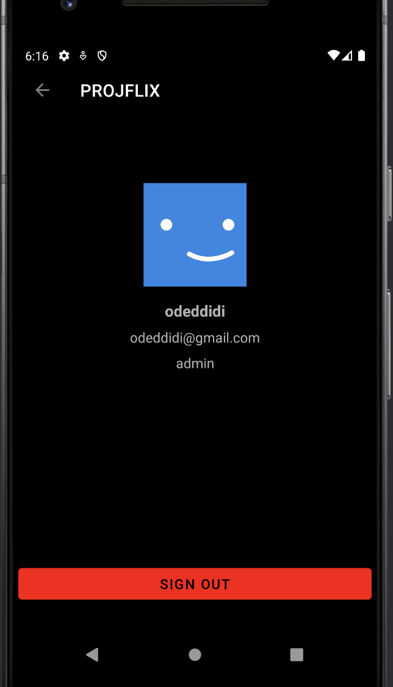

- In light mode:

  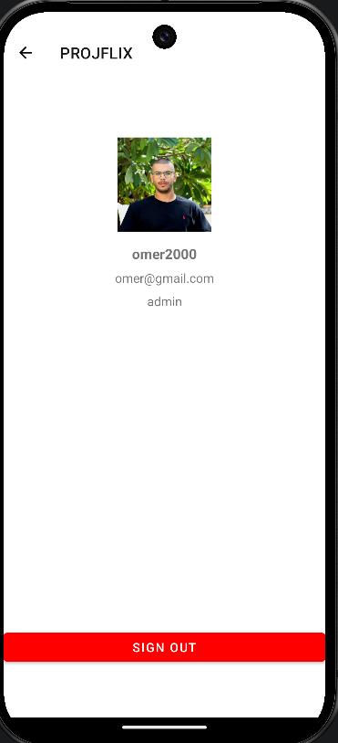

### 7. Movie Details Activity

- The Movie Details Activity open after clicking on a movie and uniqe to every movie.
- This activity displayes all the info about the movie (name,duration,director...) and a play button. 
- Also displays similar movies using recaycler view and adapter.

  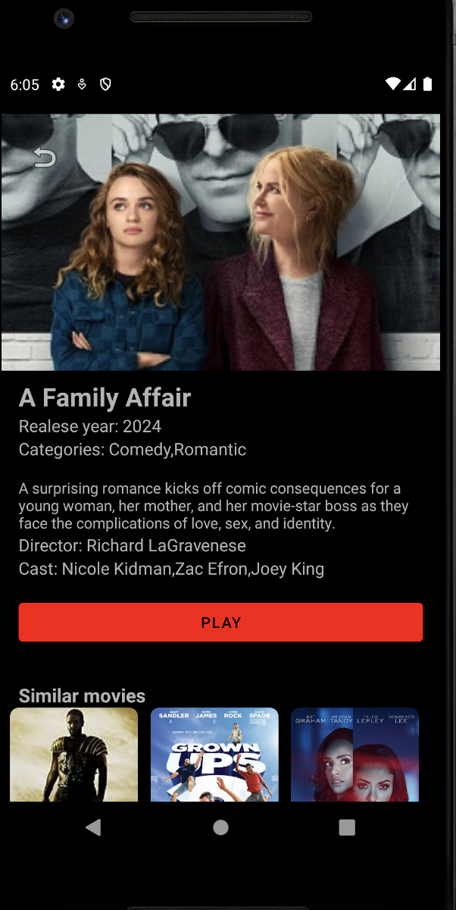

- In light mode:

  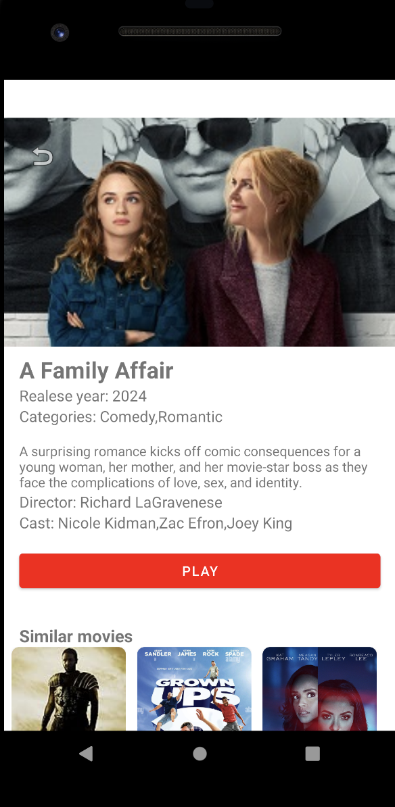

### 8. Video player
the page where you can watch the full movie

  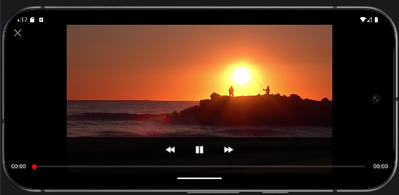

---

## Admin Activities

### Home Activity

- Same as the users Home Activity but with extra button for the admin area in the action bar. 

  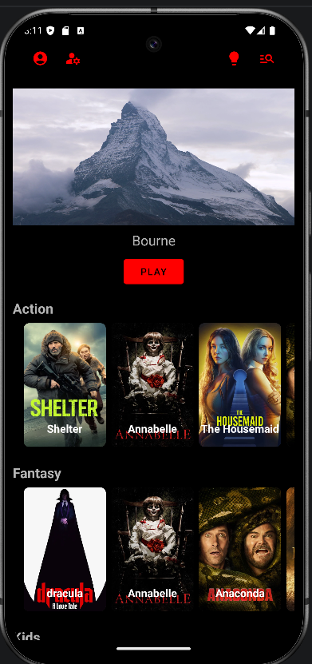

### Admin Category activity 
- Clicking the admin button will open the admin activity
- The admin can choose between categories and movies 

  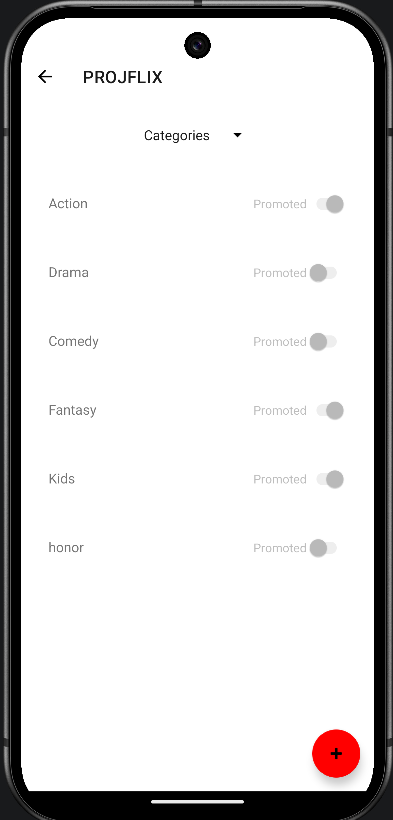

### Add Catgory Activity
- In the categories admin activity the admin can add a category:

  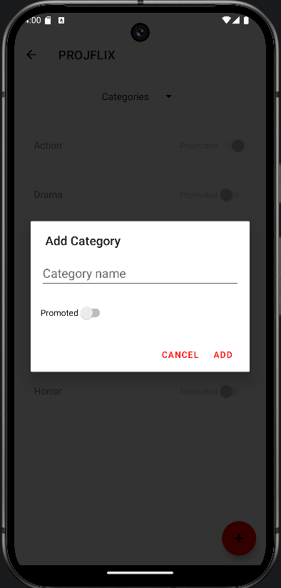

- For example:

  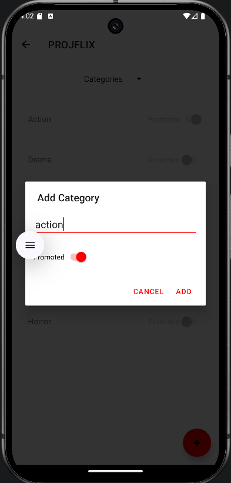

### Admin Movies Activity
- The activity that alows the admin to manage all the movies 

  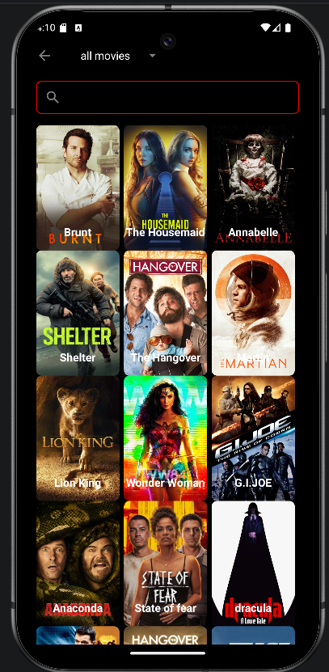

### Add Movie Activity
- In the movies admin activity the admin can add a movie:

  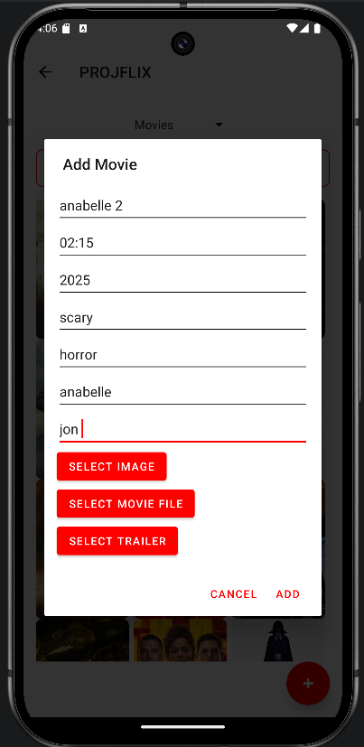

- For example:

  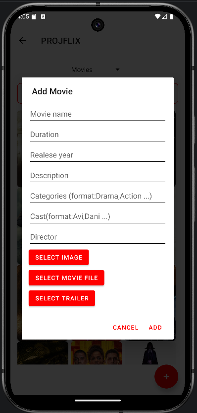

### Edit Movie Activity
- In the movies admin activity the admin can edit a movie:

  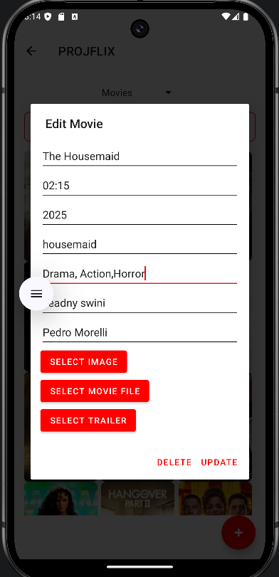

## instructions for admin 
after you create a user you shuld go to the data base **nongoDB compass** 
then you will see the new user under **users** 

  

- change the role from **user** to **admin** 

  

**important**: to use the admin fetures you should log out and log in again.
