# Web Application Documentation
## Table of Contents
- [Overview](#Overview)
- [pages](#pages)
- [componnents](#components)
- [admin-instructions](#instructions-for-admin)

## Overview
This is a **React-based** frontend for a **Movie Management System** that integrates with a **Node.js backend**. The system allows users to **browse, search, add, edit, and delete movies and categories** while maintaining user authentication and admin roles.

## Pages

### 1. Welcome Page
- The landing page of the application.
- Displays a hero banner or introductory section.

  

### 2. SignUp Page
- Allows new users to **create an account**.
- Contains fields for **email, password, confirm password, and profile picture**.

### 3. SignIn Page
- Enables existing users to **log in**.
- Requires **email and password**.

### 4. HomePage
- Displays **movies categorized by promoted categories**.
- Each movie appears as a **medium-sized movie component** with trailer previews.

  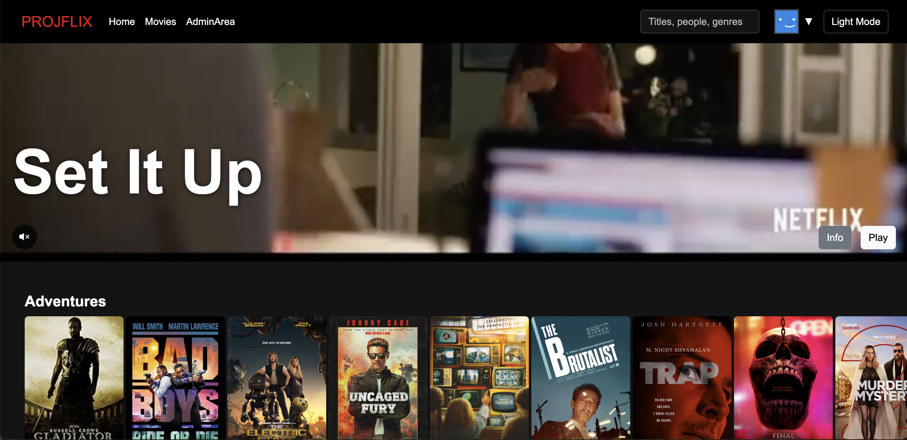

### 5. Movies Page
- Display random movie that his trailer playing on loop
- Displays **all available movies** categorized properly.
- Uses a **movie list** and filterable movie display.

### 6. Admin Page

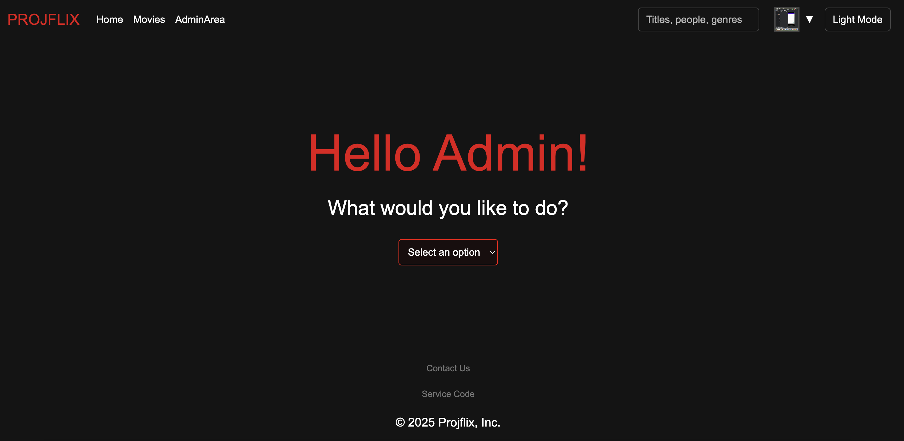

- Provides **administrative actions**:
  - Add Movie 
  **important:** categories and cast you write with ',' seperate between every string 
  - Edit Movie 
  **instructions**: search the movie you want to edit and then fill all
  - Delete Movie
  **instructions**: search the movie and delete him
  - Add Category
  - Edit Category
  - Edit Category 

 

  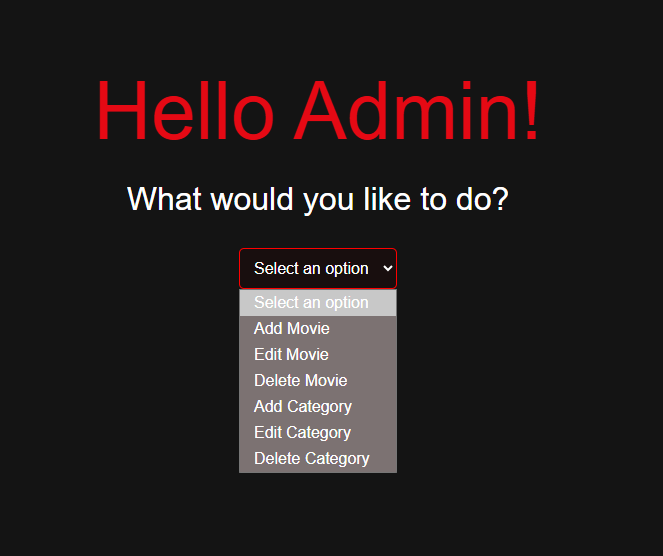
 

### 7. Search Page
- Allows users to **search movies dynamically**.
- Uses the **SearchBox component** which fetches results in real-time.

## On the navbar if you will open the optiond drop down: 

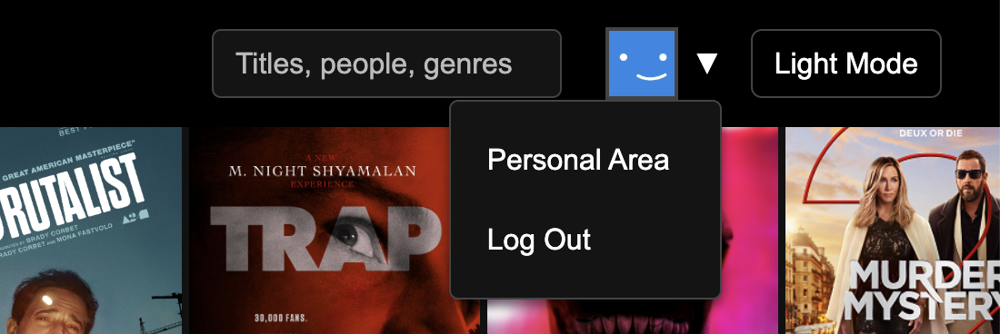

### 8. Profile Area
- Displays user **profile details**.
- Allows updates to **profile settings, preferences, and password**.

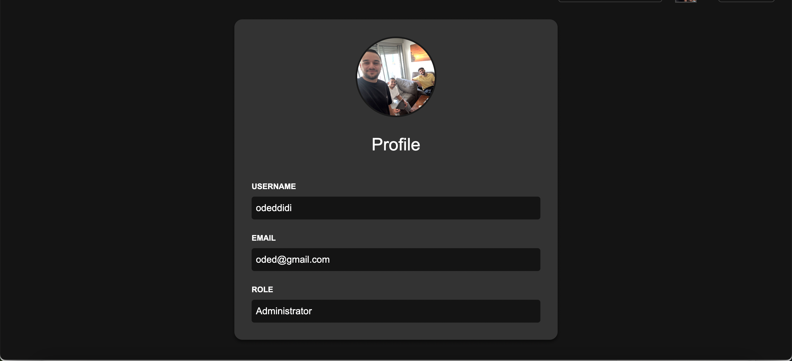

### 9. Video player
the page where you can watch the full movie

---

## Components

### 1. `MovieComponent`
- Small movie component displaying **only the movie poster**.

  

### 2. `MedMovie`
- Medium-sized movie component showing:
  - Movie trailer playing auttomaticly
  - Release year
  - Categories

  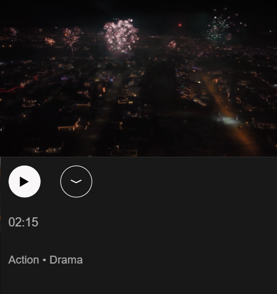

### 3. `MainMovie`
- Large movie component displaying:
  - Movie trailer
  - **All details** (title, description, duration, etc.)
  - **Recommended movies** based on selected movie

    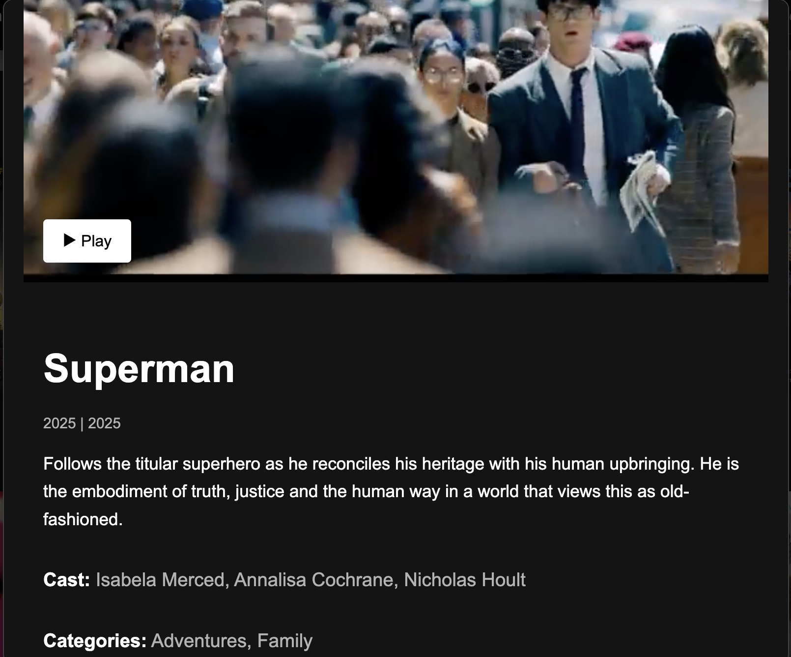
    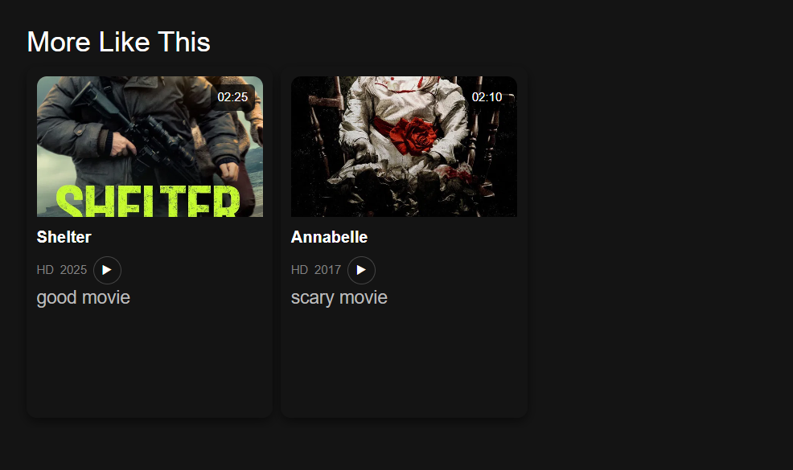
    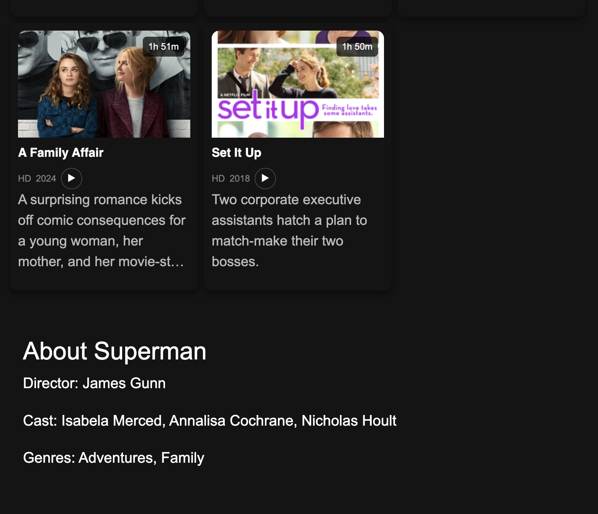

### 4. `MovieList`
- Component that **renders a list of movies** dynamically.

### 5. `SearchList`
- Dropdown search result list integrated with `SearchBox`.

  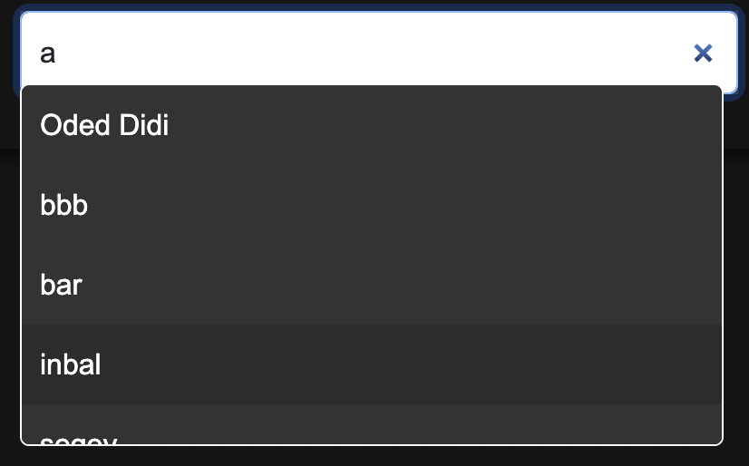

### 6. `NavBar`
- Navigation bar containing:
  - **home**
  - **movies**
  - **adnin area (for admins only)**
  - **Search**
  - **Profile area**
  - **Logout button**
  - **Light mode toggle**

  

### 7. `Footer`
- Footer section of the site with links and credits.

### 8. `SimilarTable`
- Displays **movies similar** to the currently viewed movie.

### 9. `Popup`
- Used for displaying detailed **movie information** in a modal.

  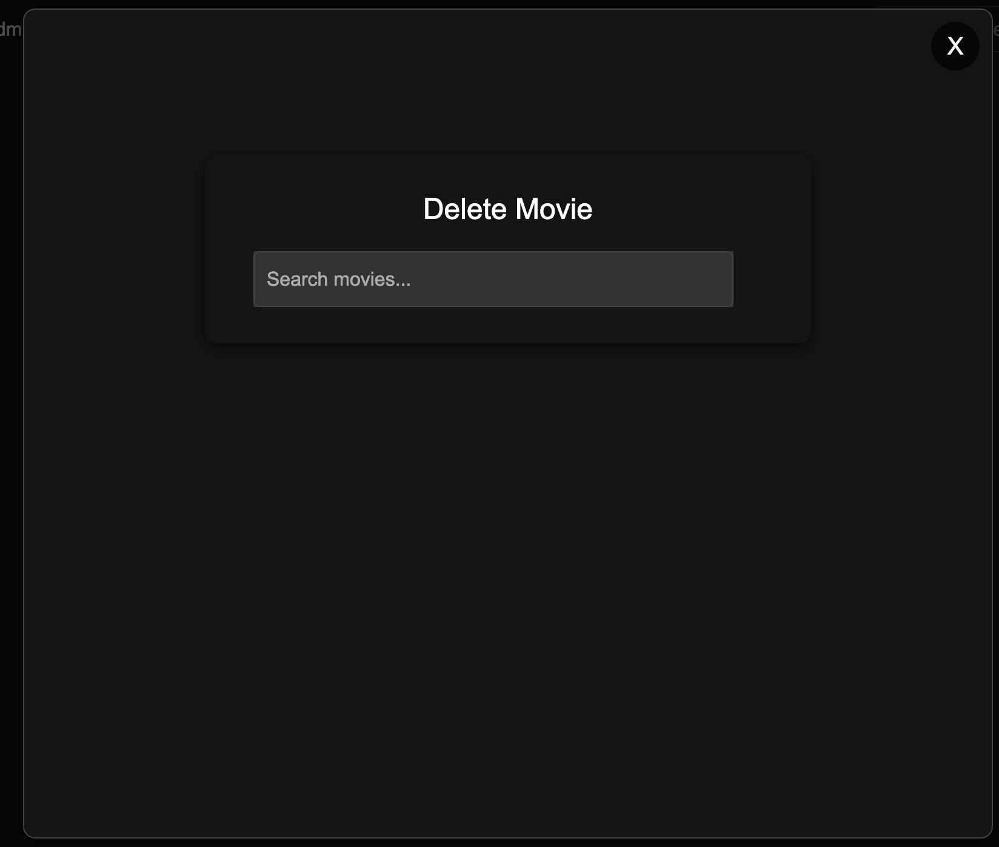

### 10. `HomeVideoPlayer`
- A background video player appearing at the **top of the homepage**.
   

---
## instructions for admin 
after you create a user you shuld go to the data base **nongoDB compass** 
then you will see the new user under **users** 

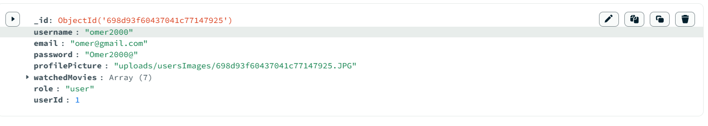

- change the role from **user** to **admin** 

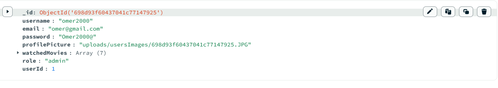

**important**: to use the admin fetures you should log out and log in again. 
